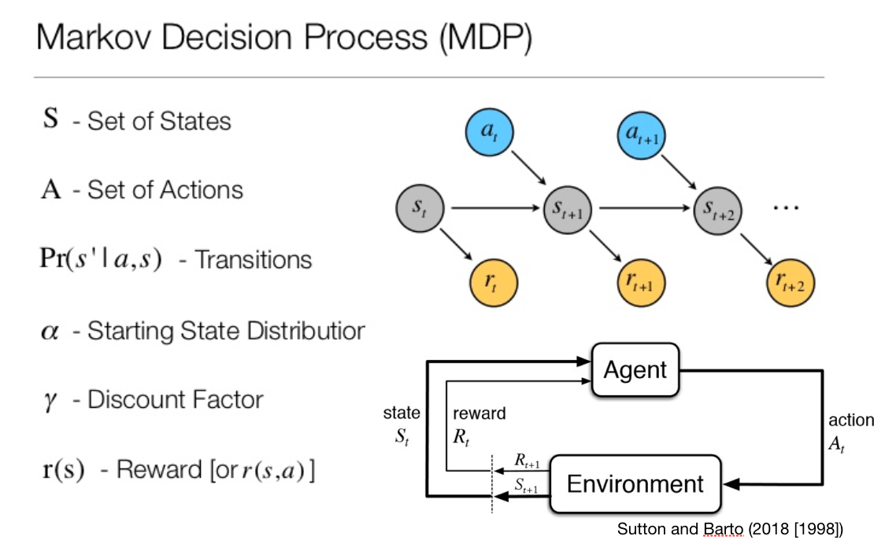
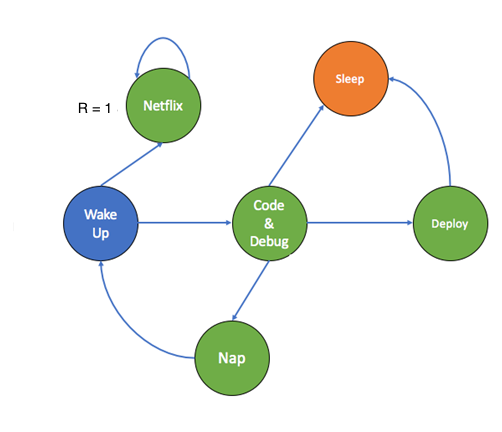
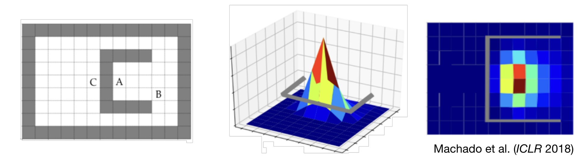
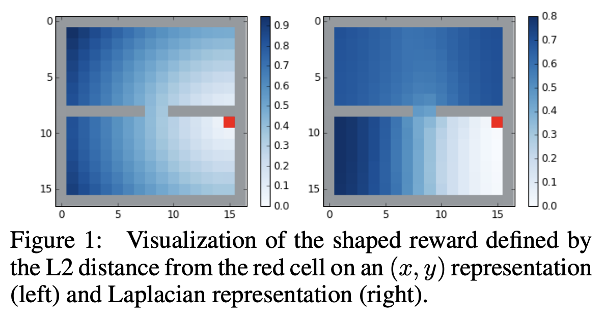

This is a summary of the ICLR paper [The Laplacian in RL: Learning Representations with Efficient Approximations](https://openreview.net/forum?id=HJlNpoA5YQ) by Yifan Wu (yw4@andrew.cmu.edu), George Tucker, and Ofir Nachum.

Summary by [Charley Wu](https://charleywu.github.io) (no relation Yifan Wu).


# Generalization in RL

The RL framework by @sutton2018reinforcement commonly represents the environment in the form of a Markov Decision Process (MDP)



An MDP is a type of graph representation, where nodes represent states and edges are transitions between states. An agent selects actions in order to transition across the graph structure. While building a representation of the transition structure (i.e., model-based RL) is not always necessary, it can help to generalize limited observations of reward to other states.



For example, if we know that $R(Netflix)=1$, then we may also want to generalize this observation to states predictive of watching netflix (e.g., waking up in this example). 

One approach to generalization comes from the Successor Representation [SR; @dayan1993improving].

## Successor Representation
@dayan1993improving showed that the value function of a TD-learning agent can be decomposed into a linear combination of state transitions $M(s,s')$ and learned reward representation $R(s')$:
$$
\begin{equation}
V(s) = \sum_{s'}M(s,s')R(s')    
\end{equation}
$$
This matrix of state representations $M(s,s')$ is the SR, where each element $m_{jk}$ encodes the similarity of successor states for states $s_j$ and $s_k$ [@dayan1993improving; @gershman2018successor; @momennejad2017successor]. Intuitively, the SR can be understood as a similarity measure based on expectations of future state transitions, rather than the singular features of each state. Thus, rewards generalize based on future transition probability.

Consider this example from @Machado2018Eigenoption. Assume A is a reward state. Because of the obstacle in the environment, the similarity $M(A,C)$ is less than $M(A,B)$, since moving from C-->A requires more steps than B-->A, even though the euclidean distance between A and C is less.  




### Computing the SR
When the transition structure of the task is known \textit{a priori}, the SR can be computed in closed form:
$$
\begin{equation}
M(s,s') = (I - \gamma T)^{-1}, 
\end{equation}
$$

where $I$ is the identity matrix, $\gamma$ is the TD discount factor, and $T$ is the transition matrix where $t_{jk}=P(s'=k|s=j)$. A common approach is to assume a random walk over the state space and set the transition matrix to:
$$
\begin{equation}
   T = D^{-1}A,
\end{equation}
$$
where $D$ is the degree matrix and $A$ is the adjacency matrix (more on that later).

But if the transition matrix $T$ is not yet known, the SR can still be learned online through prediction error learning:
$$
\begin{equation}
\hat{M}_{t+1}(s_t,s') = \hat{M}_{t}(s_t,s')  + \alpha \left[\delta(s_t=s') + \gamma \hat{M}_{t+1}(s_t,s') - \hat{M}_{t}(s_t,s')\right]
\end{equation}
$$

However, this may still require:

* knowing all states $s \in S$
* experiencing many transitions from $s_t$ to $s'$ in order to gradually learn $M(s_t,s')$

**The main goal of this paper is to provide an efficient approximate solution for computing state similarity**

## The Graph Laplacian

So far we have talked about the SR, but this paper talks about Graph Laplacian. How are these concepts related? 

It turns out that the Graph Laplacian has direct equivalencies to the SR [see @stachenfeld2014NIPS], where both capture a representation of the transition structure of a graph.




Let's try out an example


```{r message=FALSE}
#Load packages
packages <- c('dplyr', "ggplot2", 'GGally', 'network', "RColorBrewer", "igraph", 'matrixcalc', 'Matrix', 'lattice', 'jsonlite', 'viridis')
invisible(lapply(packages, require, character.only = TRUE)) #load packages. Not all are used, but I'm too lazy to check
pal <- rainbow(17) #define color palette

#Generate a graph from a news media dataset (https://github.com/kateto/R-igraph-Network-Workshop-NetSciX), where here we set node size to the audience size (millions), and edge weight based on mentions
nodes <- read.csv("data/Dataset1-Media-Example-NODES.csv", header=T, as.is=T)
links <- read.csv("data/Dataset1-Media-Example-EDGES.csv", header=T, as.is=T)
g <- graph_from_data_frame(d=links, vertices=nodes, directed=T) 
g <- simplify(g, remove.multiple = F, remove.loops = T) #remove loops
g <- as.undirected(g) #convert to undirected graph
E(g)$weight <- E(g)$weight/max(E(g)$weight) #normalize edge weights
V(g)$audience.size <- V(g)$audience.size/max(V(g)$audience.size) #also normalize node sizes
#Plot graph
ggnet2(g, node.size =V(g)$audience.size , color =pal, label = V(g)$media, edge.size ='weight') + theme(legend.position='none')
```


The Graph Laplacian $L$ is actually really easy to calculate if you know the transition structure of the graph: 
$$
\begin{equation}
L = D-A,
\end{equation}
$$
where $D$ is the Degree matrix with the (weighted) degree of each node along the diagonal and $A$ is the (weighted) adjacency matrix
```{r}
palf <- colorRampPalette(c("white", "black")) #black and white palette

#Degree matrix
D <- diag(strength(g)) 
rownames(D) <- V(g)$media
colnames(D) <- V(g)$media
heatmap(D[,17:1], Rowv =NA, Colv = NA, col = palf(100), scale="none", margins=c(10,10) )

#Adjacency matrix (weighted if graph is also weighted)
if(is_weighted(g)){
  A <- as_adjacency_matrix(g,  attr="weight", sparse=F)  
}else{
  A <- as_adjacency_matrix(g, sparse=F) #unweighted version just as an example
}

rownames(A) <- V(g)$media
colnames(A) <- V(g)$media
heatmap(A[,17:1], Rowv =NA, Colv = NA, col = palf(100), scale="none", margins=c(10,10) )


#Graph Laplacian
L = D- A
heatmap(L[,17:1], Rowv =NA, Colv = NA, col = palf(100), scale="none", margins=c(10,10) )
```

#### Some interesting properties:
* $L$ is symmetric, and has $n$ real eigenvalues (where $n$ is the number of nodes) and its eigenvectors are orthogonal
* L is positive semi-definite and thus all eigenvalues are non-negative


### Quick caveat: There are a number of different Laplacians that are easy to confuse.

##### Normalized Laplacian

$$\tilde{L} = I -D^{-1/2}LD^{-1/2}$$
$\tilde{L}$ has "normalized" eigenvalues that share the same eigenvalues as the SR [@stachenfeld2014NIPS]

```{r}
#Normalized Laplacian
I <- diag(rep(1,length(V(g)))) #identity matrix
L_normed <- I - sqrt(solve(D))%*%L%*%sqrt(solve(D))
heatmap(L_normed[,17:1], Rowv =NA, Colv = NA, col = palf(100), scale="none", margins=c(10,10) )
```


#### Row-normalized Laplacian


$$L_{RW} = I -D^{-1}A$$

$L_{RW}$ has rows sum to 1, indicating the transition probabilities of a random walk along the graph. This is of a similar form as used in the closed form SR computation.

```{r}
#Row-normalized Laplacian
L_rownorm <- I - solve(D)%*%A
heatmap(L_rownorm[,17:1], Rowv =NA, Colv = NA, col = palf(100), scale="none", margins=c(10,10) )

```

### Relating the Graph Laplacian to the SR

If $M(s,s')=(1-\gamma T)^{-1}$ and given a normalized graph Laplacian $\tilde{L}= I -D^{-1/2}LD^{-1/2}$, the i-th eigenvalue $\lambda_i$ of the SR and the j-th eigenvalue $\lambda_j$ of the normalized Laplacian can be equated as

$$
\begin{align}
    \lambda_j=\left(1-(1-\lambda_i^{-1})\gamma^{-1}\right),
\end{align}
$$
and the i-th eigenvector $u_i$ of the SR and the j-th eigenvector $u_j$ of the normalized Laplacian are related by
$$
\begin{align}
u_j=(\gamma^{-1}D^{1/2})u_i
\end{align}
$$

See @Machado2018Eigenoption for more details [originally shown in @stachenfeld2014NIPS but not very detailed]. 

# Eigenvectors of the Graph Laplacian

What we're primarily interested in are the Eigenvectors of the Graph Laplacian, since these provide us with a compressed representation of the state dynamics of the MDP. For example, the $d$ smallest eigenvectors of the Laplacian provide an embedding for each state $s\in S$ in $\mathbb{R}^d$, where distances in this reduced representation capture state similarity. 

```{r}
#Calculating the eigenVectors
ev <- eigen(L)
eigenValues <- ev$values
plot(eigenValues) #eigenValues
eigenVectors <- ev$vectors
heatmap(eigenVectors, Rowv = NA, Colv = NA, col = palf(100), scale="none", margins=c(10,10)) #Eigen vectors

#embed the graph in 2D using the two smallest eigen vectors
V(g)$x <- eigenVectors[,17] #Set X coordinates
V(g)$y <- eigenVectors[,16] #Set Y coordinates
ggnet2(g,mode = c('x','y'),node.size =V(g)$audience.size , color =pal, label = V(g)$media, edge.size ='weight') + theme(legend.position='none')
```

However, performing the eigenvector decompoisition can be computationally expensive for large graphs. Additionally, enumerating the entire statespace may be intractable. Can we approximate the eigenvectors of the Laplacian without directly having access to the Laplacian?

## Approximating the Eigenvectors

Instead of assuming we have full knowledge of the connectivity structure of the graph, let's take a function learning approach and try to learn an approximate set of $d$ eigenfunctions $\{f_1,...,f_d\}$. These eigenfunctions will allow us to map any state $s$ into $\mathbb{R}^d$ defined by feature map $\phi(s) = [f_1(s),...,f_d(s)]$, which creates a low-dimensional embedding of the state-space. Distance between states projected into this embedding allow us to approximate successor similarity.

In learning these functions, we want two qualities:

* The functions should attempt to be orthonormal, although enforcing this condition exactly may be intractable in innumerable state spaces
* states that belong to similar trajectories should be embedded close together, proportional to the frequency of being found in the same trajectory

### Optimization with constraints

Minimize the objective:

$$
\begin{equation}
G(f_1, ..., f_d) = \frac{1}{2}\mathbb{E}_{s\sim\rho, s' \sim P^\pi(\cdot|s)}\left[\sum_{k=1}^d \left(f_k(s) - f_k(s')\right)^2 \right]
\end{equation}
$$
We want to minimize the euclidean distance $\sum_{k=1}^d \left(f_k(s) - f_k(s')\right)^2$ between states $s$ and $s'$, but where we penalize harder for pairs $(s,s')$ that occur more often, where $P^\pi(\cdot|s)$ is the transition function for a fixed policy $\pi$, which forms a Markov chain with stationary distribution $\rho$. Put simply, *states that occur together belong together*.

However, we still need to ensure some degree of orthonormality amongst the eigenfunctions. We first relax this into a soft constraint:

$$
\begin{equation}
\sum_{j,k} \left( \left \langle f_j,f_k \right \rangle_\mathcal{H} - \delta_{jk}\right)^2 \lt \epsilon
\end{equation}
$$
where $\delta_{jk}=1$ if $j=k$, and $\delta_{jk}=0$ otherwise. Thus, we want violations of orthonomality to be less than some $\epsilon$. 

We can then rewrite this inequality as:
$$
\begin{equation}
\sum_{j,k} \left( \left \langle f_j,f_k \right \rangle_\mathcal{H} - \delta_{jk}\right)^2 \lt \epsilon = \sum_{j,k}\mathbb{E}_{s\sim\rho, s' \sim \rho}\left[(f_j(s)f_k(s) - \delta_{jk})(f_j(s')f_k(s') - \delta_{jk})  \right] \lt \epsilon
\end{equation}
$$


We can transform this constraint into a penalty, and then solve it as an unconstrained minimization problem.

$$
\begin{equation}
\hat{G}(f_1, ..., f_d) = \frac{1}{2}\mathbb{E}_{s\sim\rho, s' \sim P^\pi(\cdot|s)}\left[\sum_{k=1}^d \left(f_k(s) - f_k(s')\right)^2 \right] + \beta \sum_{j,k}\mathbb{E}_{s\sim\rho, s' \sim \rho}\left[(f_j(s)f_k(s) - \delta_{jk})(f_j(s')f_k(s') - \delta_{jk})  \right]
\end{equation}
$$
where $\beta$ is the penalty weight. To break it down a bit:

* The first term samples states $s$ and $s'$ from policy $\pi$, and then wants to minimize their euclidean distance in $\mathbb{R}^d$. This is repeated over many samples, and averaged based on the frequency of $s$ and $s'$ occuring together
* We also want the learned eigenfunctions to be as orthonormal as possible, adding a penalty proportional to their inner product

Thus, we can imagine a dynamic system with an *attractor* component, pulling similar states together. At the same time there is a *repulsor* component, that which all state embeddings $\phi(s)$ away from each other in order to make maximal use of the representational space.


# References
